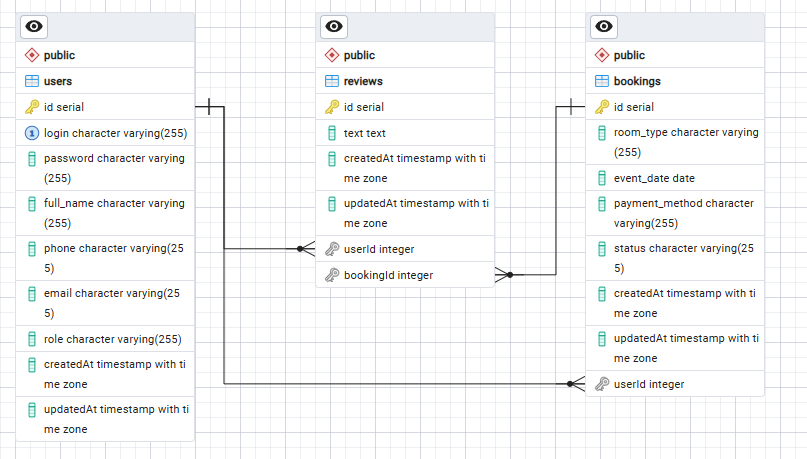
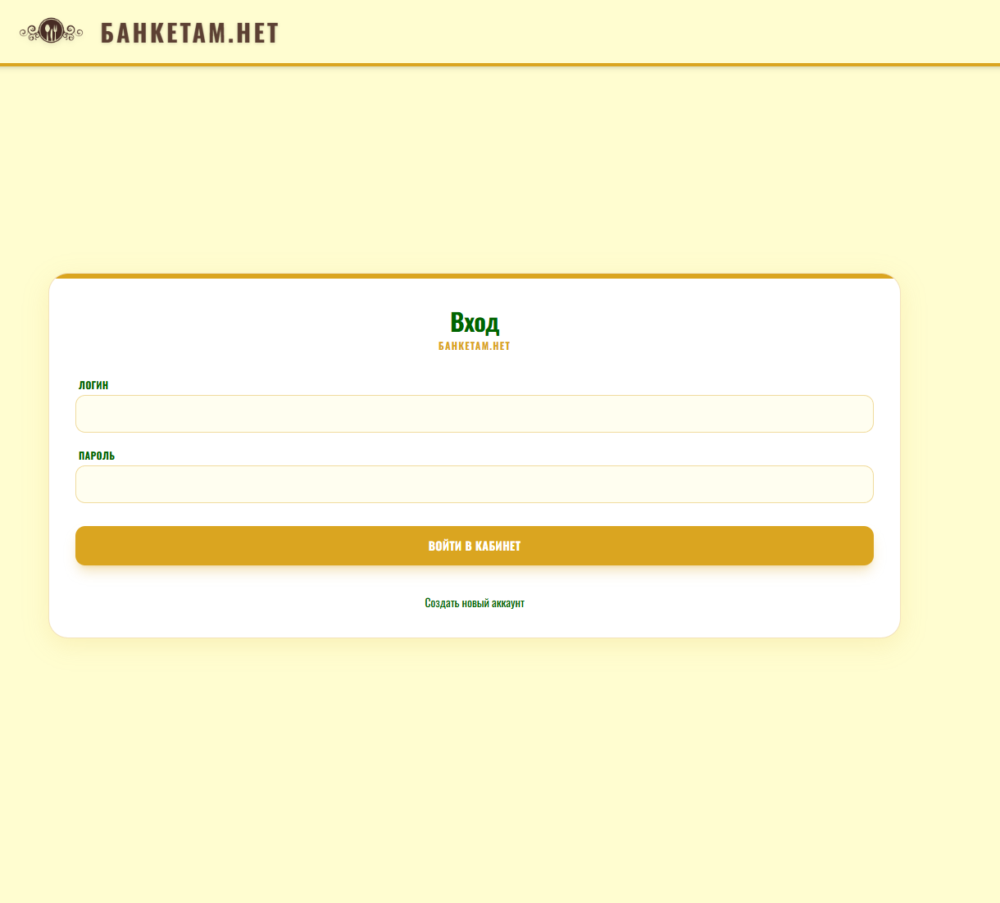
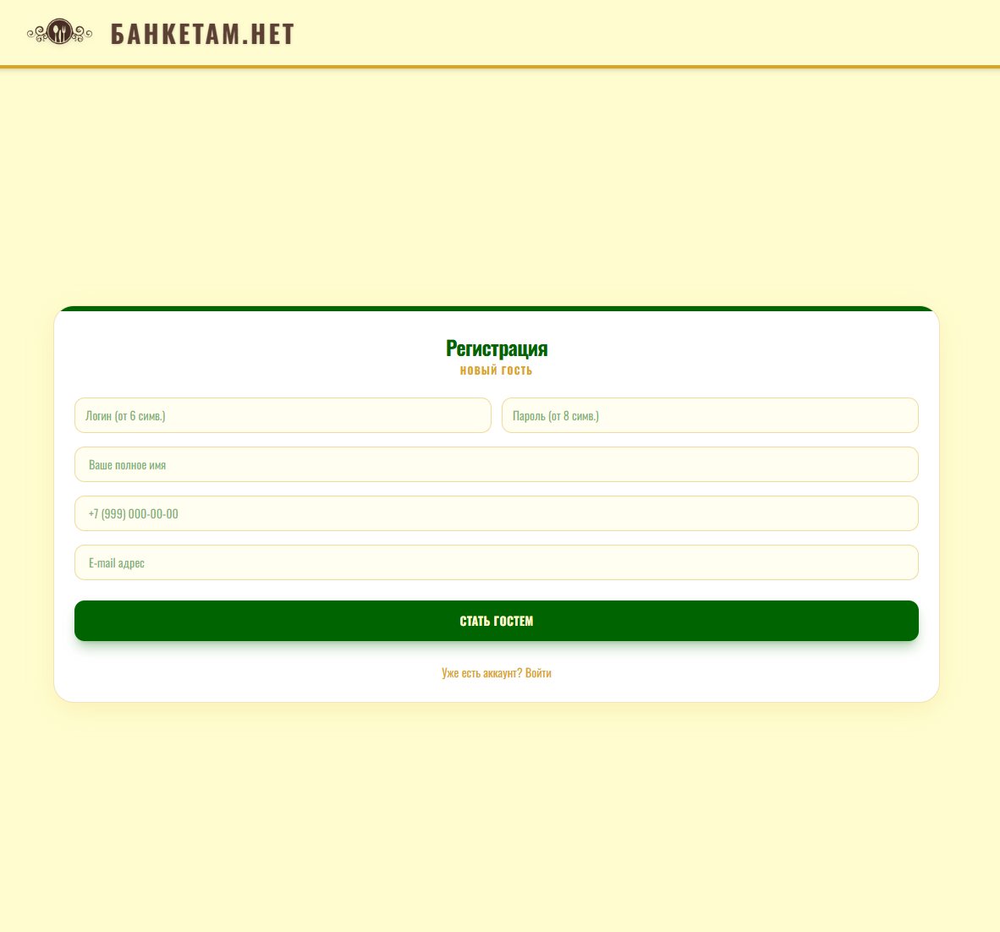
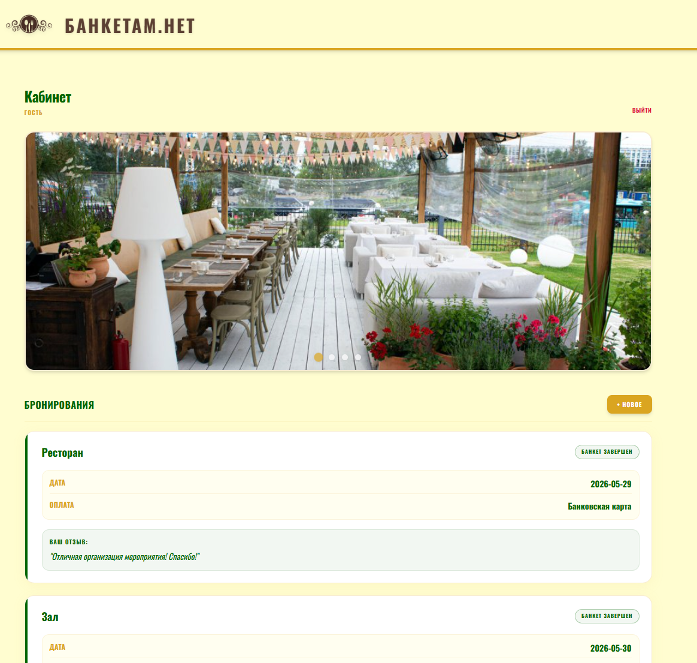
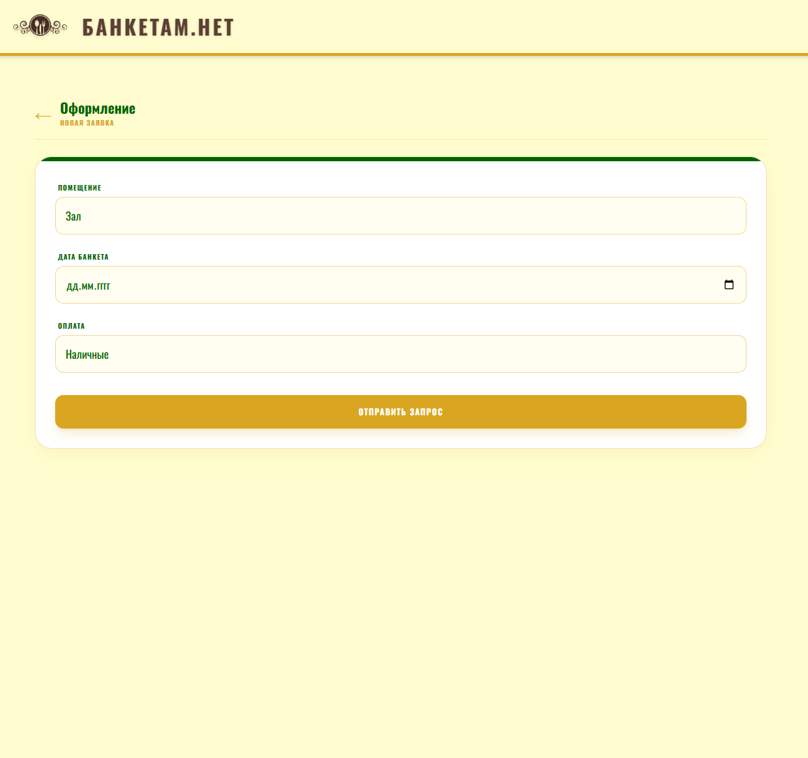
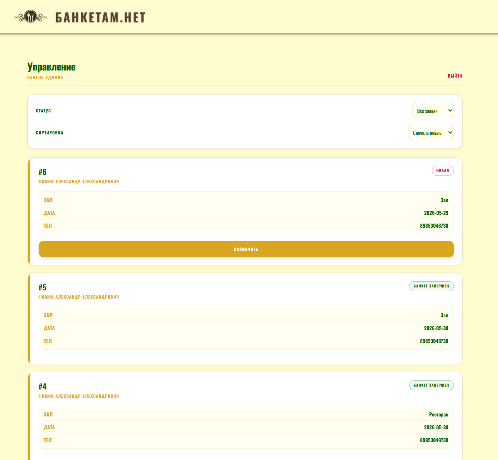

# Информационная система «Банкетам.Нет»

Проект разработан в рамках выполнения практического задания Демонстрационного экзамена (Модули № 1, 2 и 3). 
Информационная система предназначена для бронирования помещений для проведения банкетов (залы, рестораны, летние и закрытые веранды).

## 📋 Реализованный функционал (согласно ТЗ)

### Модуль 1: Проектирование и разработка ИС
* Спроектирована база данных PostgreSQL с использованием ORM Sequelize (ER-диаграмма прилагается).
* Реализована **Регистрация** с валидацией полей (логин от 6 символов, пароль от 8 символов) и **Авторизация** по стандарту JWT.
* Разработан **Личный кабинет пользователя** с возможностью просмотра истории заявок и создания новых бронирований.
* Разработана защищенная **Панель Администратора** с возможностью просмотра всех заявок и изменения их статусов («Новая», «Банкет назначен», «Банкет завершен»).

### Модуль 2: Разработка дизайна веб-приложений
* Разработан современный премиальный UI-дизайн с использованием гибридной адаптивной верстки (корректное отображение на ПК и смартфонах с разрешением 390×844).
* Настроен автоматический слайдер изображений (интервал 3 секунды, элементы управления).
* Реализована система написания **отзывов** (форма появляется только после изменения статуса заявки администратором).
* В Панель Администратора добавлены инструменты фильтрации, сортировки и постраничной навигации (пагинации).

### Модуль 3: Оптимизация
* Добавлены микроанимации интерфейса (плавное появление карточек, эффекты наведения и нажатия кнопок).
* Обеспечено высокое качество программного кода с разделением на компоненты.

---

## 🛠 Технологический стек веб-разработки
* **Backend:** Node.js, Express.js.
* **База данных:** PostgreSQL, Sequelize ORM.
* **Аутентификация:** JSON Web Token (JWT), bcrypt (хеширование паролей).
* **Frontend:** React, Vite, React Router DOM (навигация).
* **Стилизация:** Tailwind CSS v4, кастомные CSS-анимации.
* **HTTP-клиент:** Axios (с автоматической инъекцией Bearer токена).

---

## 📂 Структура проекта

```text
system_base/
├── ERD.png                   # ER-диаграмма базы данных
├── backend/                  # Серверная часть (REST API)
│   ├── .env                  # Переменные окружения (БД, JWT_SECRET)
│   ├── src/
│   │   ├── config/           # Конфигурация подключения к БД
│   │   ├── controllers/      # Контроллеры (auth, booking, review)
│   │   ├── middleware/       # Защита маршрутов (проверка токена и роли)
│   │   ├── models/           # Модели данных Sequelize и связи
│   │   ├── routes/           # Маршрутизация API
│   │   └── index.js          # Точка входа, запуск сервера
│   └── package.json
│
└── frontend/                 # Клиентская часть (SPA)
    ├── public/               # Статические ресурсы (изображения, шрифты)
    ├── src/
    │   ├── api/              # Настройка Axios
    │   ├── assets/           # Иконки и локальные ресурсы
    │   ├── components/       # Переиспользуемые UI компоненты (Slider)
    │   ├── pages/            # Экраны приложения (Login, Register, Dashboard, Admin и др.)
    │   ├── App.jsx           # Главный компонент, маршрутизация React Router
    │   ├── App.css           # Кастомные стили и микроанимации
    │   ├── index.css         # Директивы Tailwind
    │   └── main.jsx          # Точка входа React
    ├── vite.config.js        # Конфигурация сборщика Vite
    └── package.json
```

---

## 🚀 Инструкция по развертыванию

### 1. Подготовка базы данных
* Установите PostgreSQL и pgAdmin.
* Создайте пустую базу данных (название по умолчанию `banketam_db`).
* Убедитесь, что параметры подключения в файле `backend/.env` совпадают с вашими локальными настройками.

### 2. Запуск серверной части (Backend)
```bash
cd backend
npm install
npm run dev
```
*Примечание: При первом запуске сервера ORM автоматически создаст необходимые таблицы в базе данных и сгенерирует учетную запись администратора, требуемую по ТЗ (Логин: **Admin26**, Пароль: **Demo20**).*

### 3. Запуск клиентской части (Frontend)
```bash
cd frontend
npm install
npm run dev
```
После успешного запуска приложение будет доступно по адресу, указанному в консоли (обычно `http://localhost:5173`).

---

## 🖼 Графические материалы проекта

### ER-диаграмма


### Интерфейс информационной системы
#### Страница авторизации

#### Страницы регистрации

#### Личный кабинет пользователя

#### Страница оформления

#### Панель Администратора

```
